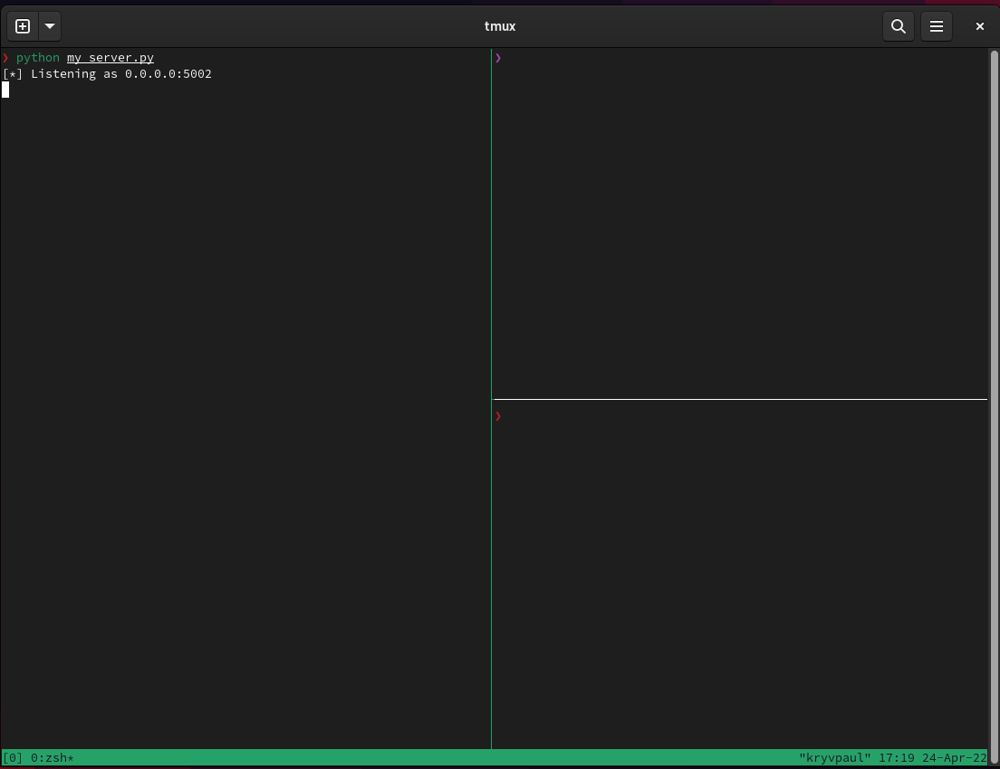
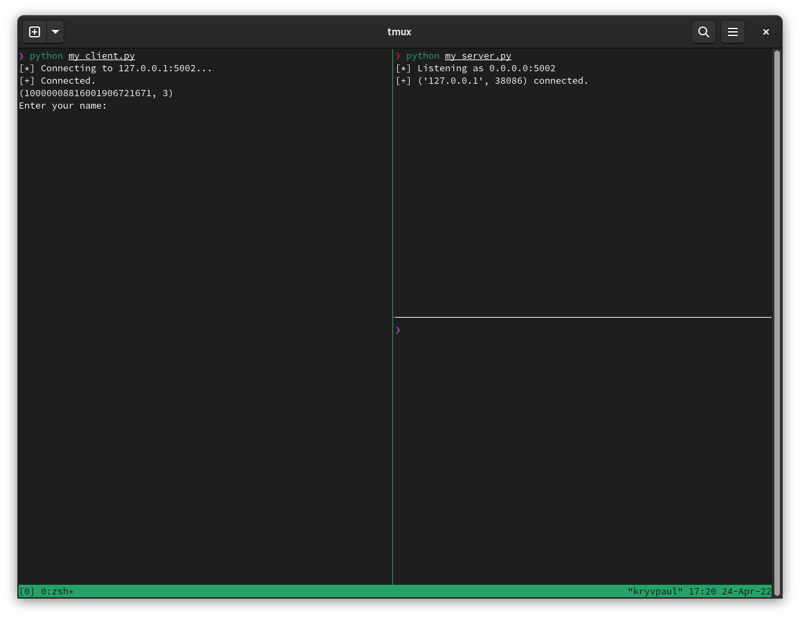
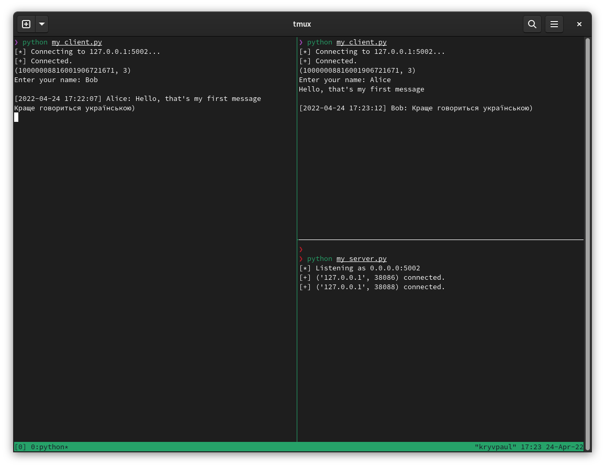

# Encryption lab work
A lab work using RSA algorithm and SHA256 for encrypted messaging using chat application.

## Usage example
1. Start the my_server.py
2. In case of using the same host as server for client just start the my_client.py
In case of using another machine put in SERVER_HOST your local ip and then start my_client.py
3. After connecting to server, type your username, and you ready to chat using encrypted methods
3. By default it's possible up to 5 simultanious connections to server

## Completed Tasks
- RSA for digital signature 
- message integrity with hashes
- Encryption algo
All this can be find in [Encrypting class](encoding.py)
